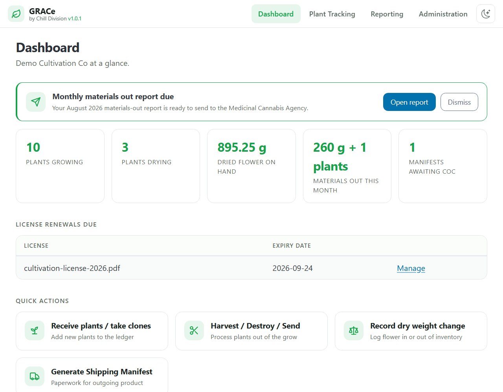
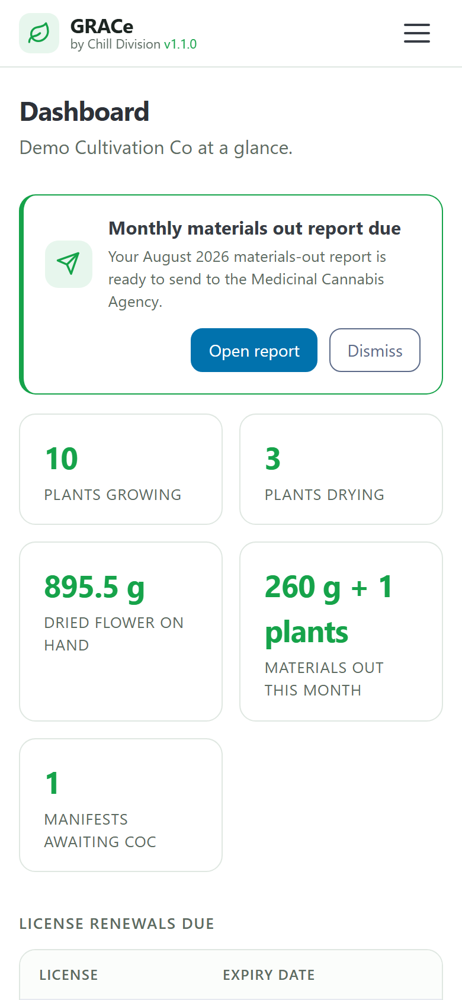

# GRACe_repo
Repository for the GRACe Portal addon for Home Assistant

Take back your time, focus on your garden, while GRACe looks after your regulatory compliance

GRACe is a simple ledger for your plants and dried flower. If you take a clone, you add to it. If you harvest a plant, you subtract it. This is the whole basis of GRACe, coupled with the intentional inability to historically edit records.

* Annual reporting / stock-take
* Monthly summaries for the Medicinal Cannabis Agency
* Minimal effort for plant tracking
* Easy Chain of Custody creation
* Report reminders on the Dashboard, and one-tap email drafts to the Agency

## First-time user guide

New to GRACe? Read the [first-time user guide](grace_addon/DOCS.md) (it's also shown on the add-on's Documentation tab inside Home Assistant). It walks through setup, adding and subtracting product, shipping, and reporting, with screenshots for PC and phone.

 

## Installation and getting started video

Check out the video on YouTube for a walkthrough of installation / getting started:

[https://youtu.be/KMqnaY6NRiY](https://youtu.be/KMqnaY6NRiY)

## Installation instructions

Go to Home Assistant Settings -> Add-ons -> Add-on Store

Tap on the 3-dot menu in the upper-right and choose "Repositories"

In the "Add" box, enter the URL of this github repo: https://github.com/Chill-Division/GRACe_repo

Click on "Add" then click on "Close".

You may need to tap the 3-button menu in the upper-right and choose "Check for updates". You should now see the new repository with the "GRACe" add-on showing underneath it.

Tap the new add-on, select "Install", then tap "Show in sidebar", "Auto update" and tap "Start".

## Your data and backups

Everything GRACe records (your ledger and every document you upload) is stored inside the add-on, so it survives updates and is included in your Home Assistant backups. Make sure automatic Home Assistant backups are turned on and copied somewhere off the box. The [user guide](grace_addon/DOCS.md#backups) shows how.

## For developers

Working on GRACe itself? [DEVELOPMENT.md](DEVELOPMENT.md) covers running it locally with demo data, and [TESTING.md](TESTING.md) covers the test suite. The rules every change must follow, for people and AI assistants alike, are in [AGENTS.md](AGENTS.md).
